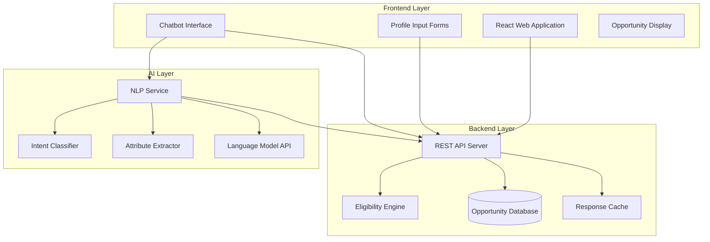

# Design Document: Opportunity Navigator

## Overview

Opportunity Navigator is a three-tier web application that provides intelligent opportunity discovery and eligibility matching. The system consists of a responsive frontend, a RESTful backend API, and an AI-powered natural language processing layer. The architecture emphasizes modularity, allowing independent scaling and maintenance of each component.

The platform acts as a routing and guidance layer, not an application processor. It matches user profiles against structured opportunity data, evaluates eligibility through rule-based logic, and redirects users to official portals for actual applications.

## Architecture

### High-Level Architecture



### Component Responsibilities

**Frontend Layer:**
- Renders responsive UI for mobile and desktop
- Collects structured profile data through forms
- Provides conversational interface for chatbot
- Displays opportunities with eligibility indicators
- Handles redirection to official portals

**Backend Layer:**
- Exposes RESTful API endpoints
- Executes eligibility evaluation logic
- Manages opportunity data storage and retrieval
- Implements caching for performance
- Validates all input data

**AI Layer:**
- Processes natural language queries
- Classifies user intent into categories
- Extracts structured attributes from text
- Generates conversational responses
- Integrates with language model API

## Components and Interfaces

### 1. Frontend Components

#### 1.1 Category Selection Component
- Displays three category buttons: Hackathons, Scholarships, Government Schemes
- Maintains selected category in application state
- Routes to appropriate profile input form

#### 1.2 Profile Input Forms
Three specialized forms based on category:

**Government Schemes Form:**
- Fields: Age (number), State (dropdown), Occupation (text), Annual Income (number), Social Category (optional dropdown)
- Validation: All required fields non-empty, age 0-120, income >= 0

**Scholarships Form:**
- Fields: Education Level (dropdown), Income Range (dropdown), State (dropdown), Social Category (optional dropdown)
- Validation: All required fields selected

**Hackathons Form:**
- Fields: Field of Interest (multi-select), Skill Level (dropdown), Location Preference (radio: Online/Offline/Both)
- Validation: At least one interest selected, skill level required

#### 1.3 Chatbot Interface
- Text input for natural language queries
- Conversation history display
- Typing indicators during processing
- Opportunity cards embedded in chat responses

#### 1.4 Opportunity Display Component
- Card-based layout showing opportunity details
- Color-coded eligibility badges (green/yellow/red)
- Expandable sections for documents and timeline
- "Apply Now" button with external link icon
- Deadline countdown display

### 2. Backend API Endpoints

#### 2.1 Opportunity Matching Endpoint
```
POST /api/opportunities/match
Request Body:
{
  "category": "scholarships" | "hackathons" | "government_schemes",
  "profile": {
    // Category-specific fields
  }
}

Response:
{
  "opportunities": [
    {
      "id": "string",
      "title": "string",
      "category": "string",
      "description": "string",
      "eligibilityStatus": "eligible" | "possibly_eligible" | "not_eligible",
      "eligibilityReason": "string",
      "benefits": "string",
      "requiredDocuments": ["string"],
      "startDate": "ISO8601",
      "deadline": "ISO8601",
      "officialLink": "string"
    }
  ],
  "matchCount": number
}
```

#### 2.2 Chatbot Query Endpoint
```
POST /api/chatbot/query
Request Body:
{
  "message": "string",
  "conversationId": "string" (optional)
}

Response:
{
  "reply": "string",
  "opportunities": [...], // Same structure as match endpoint
  "extractedProfile": {
    "category": "string",
    "attributes": {}
  },
  "conversationId": "string"
}
```

#### 2.3 Opportunity Retrieval Endpoint
```
GET /api/opportunities?category={category}&limit={limit}&offset={offset}

Response:
{
  "opportunities": [...],
  "total": number,
  "hasMore": boolean
}
```

### 3. Eligibility Engine

The Eligibility Engine is the core matching component that evaluates user profiles against opportunity criteria.

#### 3.1 Data Model

**Opportunity Schema:**
```typescript
interface Opportunity {
  id: string;
  title: string;
  category: 'hackathons' | 'scholarships' | 'government_schemes';
  description: string;
  simplifiedDescription: string;
  benefits: string;
  requiredDocuments: string[];
  startDate: Date;
  deadline: Date;
  officialLink: string;
  eligibilityCriteria: EligibilityCriterion[];
}

interface EligibilityCriterion {
  field: string; // e.g., "age", "income", "state"
  operator: 'equals' | 'greater_than' | 'less_than' | 'in_range' | 'contains' | 'in_list';
  value: any; // Single value or array for ranges/lists
  required: boolean; // true = must match, false = optional
  weight: number; // For "possibly eligible" scoring
}
```

**Profile Schema:**
```typescript
interface UserProfile {
  category: string;
  attributes: {
    [key: string]: any;
  };
}
```

#### 3.2 Eligibility Evaluation Algorithm

```
function evaluateEligibility(profile: UserProfile, opportunity: Opportunity): EligibilityResult {
  let requiredMatches = 0;
  let requiredTotal = 0;
  let optionalMatches = 0;
  let optionalTotal = 0;
  let reasons = [];

  for each criterion in opportunity.eligibilityCriteria {
    let matches = evaluateCriterion(profile.attributes[criterion.field], criterion);
    
    if (criterion.required) {
      requiredTotal++;
      if (matches) {
        requiredMatches++;
      } else {
        reasons.push(`Does not meet ${criterion.field} requirement`);
      }
    } else {
      optionalTotal++;
      if (matches) {
        optionalMatches++;
      }
    }
  }

  // Determine status
  if (requiredMatches == requiredTotal) {
    if (optionalTotal == 0 || optionalMatches / optionalTotal >= 0.5) {
      return { status: "eligible", reason: "Meets all required criteria" };
    } else {
      return { status: "possibly_eligible", reason: "Meets required criteria but few optional criteria" };
    }
  } else if (requiredMatches / requiredTotal >= 0.7) {
    return { status: "possibly_eligible", reason: reasons.join("; ") };
  } else {
    return { status: "not_eligible", reason: reasons.join("; ") };
  }
}

function evaluateCriterion(userValue: any, criterion: EligibilityCriterion): boolean {
  switch (criterion.operator) {
    case 'equals':
      return userValue == criterion.value;
    case 'greater_than':
      return userValue > criterion.value;
    case 'less_than':
      return userValue < criterion.value;
    case 'in_range':
      return userValue >= criterion.value[0] && userValue <= criterion.value[1];
    case 'contains':
      return userValue.includes(criterion.value);
    case 'in_list':
      return criterion.value.includes(userValue);
  }
}
```

### 4. AI Chatbot System

#### 4.1 Intent Classification

The Intent Classifier uses a language model to categorize user queries:

```
System Prompt:
"You are an intent classifier for an opportunity discovery platform. 
Classify the user's query into one of: HACKATHON, SCHOLARSHIP, GOVERNMENT_SCHEME, or UNCLEAR.
Respond with only the classification label."

User Query → LLM → Classification Label
```

#### 4.2 Attribute Extraction

The Attribute Extractor uses structured prompting to extract profile data:

```
System Prompt:
"Extract structured attributes from the user query for {category}.
Return JSON with fields: {field_list}.
If a field is not mentioned, use null."

User Query → LLM → JSON Attributes
```

Example:
```
Query: "I'm a 20-year-old engineering student from Maharashtra looking for scholarships"
Output: {
  "age": 20,
  "educationLevel": "undergraduate",
  "state": "Maharashtra",
  "category": "scholarship"
}
```

#### 4.3 Response Generation

After matching opportunities, the chatbot generates conversational responses:

```
System Prompt:
"You are a helpful assistant for opportunity discovery.
Present the following opportunities to the user in a friendly, conversational manner.
Include eligibility status and key details."

Opportunities + User Context → LLM → Conversational Response
```

### 5. Data Storage

#### 5.1 Opportunity Database Schema

```sql
CREATE TABLE opportunities (
  id VARCHAR(255) PRIMARY KEY,
  title VARCHAR(500) NOT NULL,
  category VARCHAR(50) NOT NULL,
  description TEXT NOT NULL,
  simplified_description TEXT NOT NULL,
  benefits TEXT NOT NULL,
  required_documents JSON NOT NULL,
  start_date TIMESTAMP NOT NULL,
  deadline TIMESTAMP NOT NULL,
  official_link VARCHAR(1000) NOT NULL,
  eligibility_criteria JSON NOT NULL,
  created_at TIMESTAMP DEFAULT CURRENT_TIMESTAMP,
  updated_at TIMESTAMP DEFAULT CURRENT_TIMESTAMP ON UPDATE CURRENT_TIMESTAMP,
  INDEX idx_category (category),
  INDEX idx_deadline (deadline)
);
```

#### 5.2 Caching Strategy

- Cache opportunity lists by category for 1 hour
- Cache eligibility evaluation results for identical profiles for 5 minutes
- Use Redis for distributed caching
- Invalidate cache on opportunity data updates

## Data Models

### Frontend State Models

```typescript
interface AppState {
  selectedCategory: Category | null;
  userProfile: UserProfile | null;
  opportunities: OpportunityWithEligibility[];
  loading: boolean;
  error: string | null;
}

interface OpportunityWithEligibility extends Opportunity {
  eligibilityStatus: 'eligible' | 'possibly_eligible' | 'not_eligible';
  eligibilityReason: string;
  daysUntilDeadline: number;
}

interface ChatState {
  messages: ChatMessage[];
  conversationId: string | null;
  isTyping: boolean;
}

interface ChatMessage {
  id: string;
  role: 'user' | 'assistant';
  content: string;
  opportunities?: OpportunityWithEligibility[];
  timestamp: Date;
}
```

### Backend Domain Models

```typescript
// Already defined in Eligibility Engine section
interface Opportunity { ... }
interface EligibilityCriterion { ... }
interface UserProfile { ... }

interface EligibilityResult {
  status: 'eligible' | 'possibly_eligible' | 'not_eligible';
  reason: string;
  score: number; // 0-100 for sorting
}
```

## Correctness Properties

*A property is a characteristic or behavior that should hold true across all valid executions of a system—essentially, a formal statement about what the system should do. Properties serve as the bridge between human-readable specifications and machine-verifiable correctness guarantees.*


### Property 1: Category Navigation Consistency
*For any* category selection, navigating to that category should display the corresponding filtering interface and maintain that category context until explicitly changed.
**Validates: Requirements 1.2, 1.3**

### Property 2: Category Switch Clears State
*For any* category switch operation, all filters and profile data from the previous category should be cleared before displaying the new category interface.
**Validates: Requirements 1.4**

### Property 3: Required Field Validation
*For any* profile submission with one or more empty required fields, the validation should fail and highlight all missing required fields with specific error messages.
**Validates: Requirements 2.4, 12.1**

### Property 4: Invalid Format Validation
*For any* profile submission with invalid data format, the validation should fail and display format requirements and examples for each invalid field.
**Validates: Requirements 2.5, 12.2**

### Property 5: Profile Data Session Scope
*For any* user session, profile data should only exist in memory during the session and should not be persisted to any storage after the session ends.
**Validates: Requirements 2.6, 9.3, 9.4**

### Property 6: Eligibility Evaluation Completeness
*For any* profile submission, the Eligibility Engine should evaluate the profile against all available opportunities in the selected category and return results for each opportunity.
**Validates: Requirements 3.1**

### Property 7: Single Status Per Opportunity
*For any* opportunity evaluation, exactly one eligibility status (Eligible, Possibly Eligible, or Not Eligible) should be returned along with a non-empty explanation.
**Validates: Requirements 3.2, 3.3**

### Property 8: Eligibility Engine Performance
*For any* profile and set of up to 100 opportunities, the Eligibility Engine should complete evaluation and return results within 2 seconds.
**Validates: Requirements 3.4, 10.2**

### Property 9: Correct Eligibility Status Assignment
*For any* profile and opportunity pair:
- If all required criteria are met, status should be Eligible
- If 70% or more of required criteria are met, status should be Possibly Eligible
- If fewer than 70% of required criteria are met, status should be Not Eligible
**Validates: Requirements 3.5, 3.6, 3.7**

### Property 10: Opportunity Display Completeness
*For any* opportunity displayed to the user, all required fields (title, category, description, eligibility status, benefits, required documents, timeline, official link) should be present in the rendered output.
**Validates: Requirements 4.1**

### Property 11: Eligibility Status Color Coding
*For any* displayed opportunity:
- Eligible status should use green color indicator
- Possibly Eligible status should use yellow color indicator
- Not Eligible status should use red color indicator
**Validates: Requirements 4.2**

### Property 12: Timeline Display Completeness
*For any* opportunity with application timeline, both start date and deadline should be displayed in a readable format.
**Validates: Requirements 4.3**

### Property 13: Deadline-Based Sorting and Filtering
*For any* set of opportunities displayed to the user:
- Opportunities should be sorted by deadline in ascending order (nearest first)
- Opportunities with past deadlines should be excluded from results
**Validates: Requirements 4.4, 4.6, 14.3, 14.4**

### Property 14: Apply Now Redirection
*For any* Apply Now button click, the platform should open the opportunity's official portal URL in a new browser tab.
**Validates: Requirements 4.5, 5.1**

### Property 15: HTTPS URL Validation
*For any* opportunity stored in the system, the official portal URL should use HTTPS protocol.
**Validates: Requirements 5.2**

### Property 16: Redirection Confirmation
*For any* redirection to an official portal, a confirmation message should be displayed to the user indicating they are leaving the platform.
**Validates: Requirements 5.5**

### Property 17: Chatbot Response Time
*For any* natural language query submitted to the chatbot, a response should be generated and returned within 3 seconds.
**Validates: Requirements 6.1**

### Property 18: Intent Classification Validity
*For any* natural language query processed by the chatbot, the Intent Classifier should return exactly one classification from the valid set: Hackathons, Scholarships, Government Schemes, or Unclear.
**Validates: Requirements 6.2**

### Property 19: Unclear Intent Handling
*For any* query classified as Unclear, the chatbot should respond with clarifying questions to determine the correct category.
**Validates: Requirements 6.3**

### Property 20: Attribute Extraction Completeness
*For any* query with classified intent, the Attribute Extractor should extract all mentioned profile attributes relevant to that category and return them in structured format.
**Validates: Requirements 6.4**

### Property 21: Chatbot-Engine Integration
*For any* successfully extracted profile attributes, the chatbot should pass them to the Eligibility Engine and receive matched opportunities in return.
**Validates: Requirements 6.5**

### Property 22: Conversational Opportunity Presentation
*For any* set of matched opportunities returned by the Eligibility Engine, the chatbot should present them in conversational format including eligibility status and key details.
**Validates: Requirements 6.6**

### Property 23: Chatbot Scope Limitation
*For any* query unrelated to opportunity discovery (hackathons, scholarships, government schemes), the chatbot should politely redirect the user to opportunity-related topics without providing unrelated information.
**Validates: Requirements 6.7, 6.8**

### Property 24: Opportunity Data Structure Completeness
*For any* opportunity stored in the system, all required structured fields (title, category, description, benefits, documents, dates, link, criteria) should be present and non-empty.
**Validates: Requirements 7.1, 7.4**

### Property 25: Eligibility Criteria Structure Validity
*For any* opportunity's eligibility criteria, each criterion should have a valid field name, a valid operator (equals, greater_than, less_than, in_range, contains, in_list), and appropriate value(s).
**Validates: Requirements 7.2, 7.3**

### Property 26: Opportunity Data Integrity
*For any* opportunity data ingested from official sources, the stored data should match the source data without modifications or alterations.
**Validates: Requirements 7.5**

### Property 27: Responsive Rendering Range
*For any* screen width between 320px and 2560px, the platform should render all content correctly without horizontal scrolling or layout breaks.
**Validates: Requirements 8.1**

### Property 28: Touch-Friendly Controls
*For any* interactive element (buttons, links, form inputs) on mobile devices, the tap target size should be at least 44px in both dimensions.
**Validates: Requirements 8.2**

### Property 29: Minimum Font Size
*For any* text element displayed on the platform, the font size should be at least 14px to maintain readability.
**Validates: Requirements 8.5**

### Property 30: No Sensitive Document Storage
*For any* user interaction with the platform, no sensitive documents, detailed financial information, or identity documents should be stored in any persistent storage.
**Validates: Requirements 9.1, 9.2**

### Property 31: HTTPS Data Transmission
*For any* data transmission between client and server, the connection should use HTTPS protocol.
**Validates: Requirements 9.5**

### Property 32: Filter Request Performance
*For any* filter request submitted by a user, results should be returned within 2 seconds.
**Validates: Requirements 10.1**

### Property 33: Well-Defined API Contracts
*For any* API endpoint exposed by the Eligibility Engine or Chatbot, the request and response schemas should be well-defined, documented, and stable across versions.
**Validates: Requirements 11.4, 11.5**

### Property 34: Engine Error Handling
*For any* error encountered by the Eligibility Engine during evaluation, the platform should display a user-friendly error message without exposing technical details.
**Validates: Requirements 12.3**

### Property 35: Chatbot Processing Error Handling
*For any* query that the chatbot cannot process successfully, it should ask the user to rephrase or provide more information rather than failing silently.
**Validates: Requirements 12.4**

### Property 36: Text Alternative Completeness
*For any* non-text content (images, icons, charts) displayed on the platform, a text alternative should be provided for screen readers.
**Validates: Requirements 13.1**

### Property 37: Keyboard Navigation Support
*For any* interactive element on the platform, users should be able to navigate to and activate it using only keyboard controls.
**Validates: Requirements 13.2**

### Property 38: Color Contrast Compliance
*For any* text element displayed on the platform, the color contrast ratio between text and background should be at least 4.5:1.
**Validates: Requirements 13.3**

### Property 39: Screen Reader Label Completeness
*For any* form input or interactive control, a meaningful label should be provided that clearly describes its purpose to screen reader users.
**Validates: Requirements 13.4**

### Property 40: Multi-Modal Information Presentation
*For any* information conveyed using color (such as eligibility status), alternative indicators (icons, text labels, patterns) should also be present.
**Validates: Requirements 13.5**

### Property 41: Deadline Countdown Display
*For any* opportunity displayed to the user, the number of days remaining until the deadline should be calculated and displayed.
**Validates: Requirements 14.1**

### Property 42: Urgency Indicator for Near Deadlines
*For any* opportunity with a deadline within 7 days, a visual urgency indicator should be displayed alongside the deadline information.
**Validates: Requirements 14.2**

### Property 43: Timezone-Aware Deadline Display
*For any* opportunity deadline displayed to the user, the date and time should be converted to and displayed in the user's local timezone.
**Validates: Requirements 14.5**

### Property 44: Simplified Eligibility Explanations
*For any* eligibility criterion displayed to the user, a simplified explanation in plain language should be provided alongside any official terminology.
**Validates: Requirements 15.1**

### Property 45: Income Threshold Contextualization
*For any* income threshold in eligibility criteria, the platform should provide common reference points or examples to help users understand the requirement.
**Validates: Requirements 15.2**

### Property 46: Document Requirement Examples
*For any* required document listed in an opportunity, examples of acceptable documents should be provided to clarify the requirement.
**Validates: Requirements 15.3**

### Property 47: Technical Term Tooltips
*For any* technical or bureaucratic term used in opportunity descriptions or criteria, a tooltip with plain language definition should be available.
**Validates: Requirements 15.4**

## Error Handling

### 1. Input Validation Errors

**Invalid Profile Data:**
- Empty required fields → Display field-specific error messages, highlight fields in red
- Invalid format (e.g., negative age, invalid state) → Display format requirements with examples
- Out-of-range values → Display acceptable range with current value

**Invalid Opportunity Data:**
- Missing required fields → Reject storage, log error for admin review
- Invalid URL format → Reject storage, flag for correction
- Invalid date format → Reject storage, flag for correction
- Invalid eligibility criteria operator → Reject storage, flag for correction

### 2. System Errors

**Eligibility Engine Errors:**
- Evaluation timeout → Return partial results with warning message
- Criteria parsing error → Skip problematic opportunity, log error, continue with others
- Database connection error → Display "Service temporarily unavailable" message, suggest retry

**Chatbot Errors:**
- LLM API timeout → Display "Processing is taking longer than expected, please try again"
- Intent classification failure → Ask clarifying questions
- Attribute extraction failure → Ask user to provide information in structured form
- No opportunities matched → Suggest broadening criteria or trying different category

### 3. External Service Errors

**Official Portal Link Errors:**
- Link unavailable (404, 500) → Display warning, provide alternative contact information
- SSL certificate error → Display security warning, do not redirect
- Timeout → Display "Official portal is currently unavailable, please try again later"

**LLM API Errors:**
- Rate limit exceeded → Queue request, display wait time estimate
- API unavailable → Fall back to structured form input, disable chatbot temporarily
- Invalid response format → Log error, ask user to rephrase query

### 4. Edge Cases

**Empty Result Sets:**
- No opportunities match criteria → Display "No opportunities found" with suggestions to broaden search
- No opportunities in category → Display "No opportunities currently available in this category"

**Deadline Edge Cases:**
- Deadline today → Display "Deadline is today!" with high urgency indicator
- Deadline in past (edge case if filtering fails) → Exclude from results
- No deadline specified → Display "Rolling deadline" or "Deadline not specified"

**Session Edge Cases:**
- Session timeout during form filling → Preserve form data in browser storage temporarily
- Multiple tabs open → Sync category selection across tabs using localStorage
- Browser back button → Restore previous state if possible

## Testing Strategy

### Unit Testing Approach

Unit tests will focus on specific examples, edge cases, and error conditions for individual components:

**Eligibility Engine Unit Tests:**
- Test specific criterion evaluation (equals, greater_than, less_than, in_range, contains, in_list)
- Test edge cases: empty criteria, missing profile fields, null values
- Test status determination with specific criterion combinations
- Test explanation generation for various scenarios

**Validation Unit Tests:**
- Test specific invalid inputs for each field type
- Test boundary values (age 0, age 120, negative income)
- Test empty strings, whitespace-only strings
- Test special characters in text fields

**UI Component Unit Tests:**
- Test category selection component with each category
- Test form rendering for each category type
- Test opportunity card rendering with specific data
- Test color indicator rendering for each status

**API Endpoint Unit Tests:**
- Test request validation with specific invalid payloads
- Test response format for specific scenarios
- Test error responses for specific error conditions

### Property-Based Testing Approach

Property-based tests will verify universal properties across all inputs using a PBT library (fast-check for TypeScript/JavaScript, Hypothesis for Python):

**Configuration:**
- Minimum 100 iterations per property test
- Each test tagged with: **Feature: opportunity-navigator, Property {number}: {property_text}**

**Test Generators:**
- Random profile data generator (valid and invalid)
- Random opportunity data generator with various criteria
- Random eligibility criteria generator
- Random natural language query generator
- Random screen width generator (320-2560px)

**Property Test Examples:**

```typescript
// Example: Property 9 - Correct Eligibility Status Assignment
test('Feature: opportunity-navigator, Property 9: Correct eligibility status assignment', () => {
  fc.assert(
    fc.property(
      profileGenerator(),
      opportunityGenerator(),
      (profile, opportunity) => {
        const result = evaluateEligibility(profile, opportunity);
        const matchedRequired = countMatchedRequiredCriteria(profile, opportunity);
        const totalRequired = countTotalRequiredCriteria(opportunity);
        const matchRate = matchedRequired / totalRequired;
        
        if (matchRate === 1.0) {
          expect(result.status).toBe('eligible');
        } else if (matchRate >= 0.7) {
          expect(result.status).toBe('possibly_eligible');
        } else {
          expect(result.status).toBe('not_eligible');
        }
        expect(result.reason).toBeTruthy();
      }
    ),
    { numRuns: 100 }
  );
});

// Example: Property 13 - Deadline-Based Sorting and Filtering
test('Feature: opportunity-navigator, Property 13: Deadline-based sorting and filtering', () => {
  fc.assert(
    fc.property(
      fc.array(opportunityGenerator(), { minLength: 1, maxLength: 50 }),
      (opportunities) => {
        const filtered = filterAndSortOpportunities(opportunities);
        
        // All opportunities should have future deadlines
        filtered.forEach(opp => {
          expect(opp.deadline.getTime()).toBeGreaterThan(Date.now());
        });
        
        // Should be sorted by deadline ascending
        for (let i = 0; i < filtered.length - 1; i++) {
          expect(filtered[i].deadline.getTime()).toBeLessThanOrEqual(
            filtered[i + 1].deadline.getTime()
          );
        }
      }
    ),
    { numRuns: 100 }
  );
});

// Example: Property 23 - Chatbot Scope Limitation
test('Feature: opportunity-navigator, Property 23: Chatbot scope limitation', () => {
  fc.assert(
    fc.property(
      offTopicQueryGenerator(),
      async (query) => {
        const response = await chatbot.processQuery(query);
        
        // Response should redirect to opportunity topics
        expect(response.reply).toMatch(/opportunity|scholarship|hackathon|scheme/i);
        expect(response.opportunities).toHaveLength(0);
        
        // Should not provide unrelated information
        expect(response.reply).not.toMatch(/weather|sports|news|recipe/i);
      }
    ),
    { numRuns: 100 }
  );
});
```

**Integration Testing:**
- Test end-to-end flows: category selection → profile input → opportunity display → redirection
- Test chatbot flow: query → intent classification → attribute extraction → matching → response
- Test error recovery flows
- Test session management across multiple interactions

**Performance Testing:**
- Load test with 100 concurrent users
- Test response times under various loads
- Test with large opportunity datasets (1000+ opportunities)
- Test chatbot with various query complexities

### Test Coverage Goals

- Unit test coverage: 80% of code
- Property test coverage: All 47 correctness properties
- Integration test coverage: All critical user flows
- Accessibility test coverage: All WCAG 2.1 Level AA criteria

### Testing Tools

- **Unit Testing:** Jest (JavaScript/TypeScript) or pytest (Python)
- **Property-Based Testing:** fast-check (JavaScript/TypeScript) or Hypothesis (Python)
- **Integration Testing:** Playwright or Cypress for end-to-end tests
- **Accessibility Testing:** axe-core, WAVE, manual screen reader testing
- **Performance Testing:** k6 or Artillery for load testing
- **API Testing:** Supertest or REST-assured

### Continuous Testing

- Run unit tests on every commit
- Run property tests on every pull request
- Run integration tests nightly
- Run performance tests weekly
- Run accessibility audits before each release
